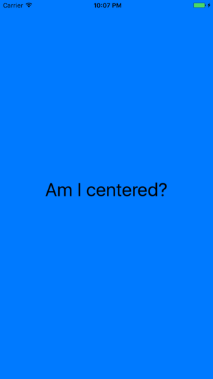

Menu: [Home](../../README.md)

## UIButton Centered with iOS9 Anchors



### Overview


### Important Functions

```swift
    var centeredButton = UIButton()
    
    func addButton() {
        
        centeredButton.translatesAutoresizingMaskIntoConstraints = false
        centeredButton.titleLabel?.font = UIFont.systemFont(ofSize: 36)
        
        centeredButton.setTitle("Am I centered?", for: UIControlState())
        centeredButton.setTitleColor(UIColor.black, for: UIControlState())
        centeredButton.addTarget(self, action: #selector(ViewController.pressed(_:)), for: .touchUpInside)
        
        self.view.addSubview(centeredButton)
        
        NSLayoutConstraint.activate([
           centeredButton.centerXAnchor.constraint(equalTo: view.centerXAnchor),
           centeredButton.centerYAnchor.constraint(equalTo: view.centerYAnchor, constant: 0),
        ])

    }
```

### Additional Functions
```swift
//
```


