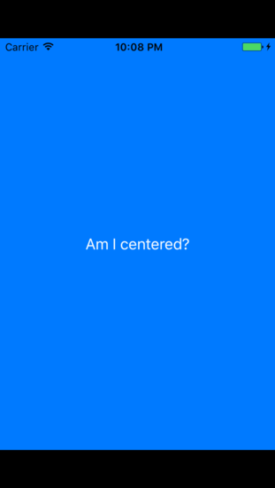

Menu: [Home](../../README.md)

## AutoLayout Centered Button



### Overview

Use centerXAnchor and centerYAnchor

### Important Functions

```swift
NSLayoutConstraint.activate([
   button.centerXAnchor.constraint(equalTo: view.centerXAnchor),
   button.centerYAnchor.constraint(equalTo: view.centerYAnchor),

   button.widthAnchor.constraint(equalToConstant: 130),
])

```


