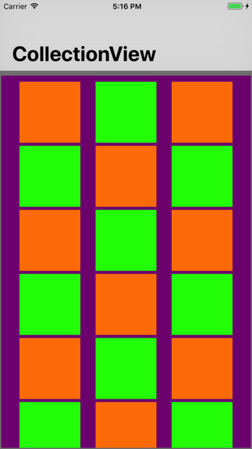

Menu: [Home](../../README.md)

## Basic UICollectionViewController



### Overview


### Important Functions

Must create with a FlowLayout if we create UICollectionViewController programatically

```swift

let flowLayout=UICollectionViewFlowLayout()
flowLayout.itemSize = CGSizeMake(100, 100)
flowLayout.minimumInteritemSpacing = 2
flowLayout.minimumLineSpacing = 5
flowLayout.scrollDirection = .Vertical

collectionViewController = BasicCollectionViewController(collectionViewLayout: flowLayout)

```

### Important Functions

```swift
self.collectionView!.register(UICollectionViewCell.self, forCellWithReuseIdentifier: reuseIdentifier)
```
### Additional Functions
```swift
//
```


* The Details
