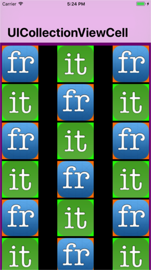

Menu: [Home](../../README.md)

## UICollectionView with Custom Cell



### Overview


### Important Functions


### Register Nib
```swift
self.collectionView!.register(UINib(nibName:"CustomCollectionViewCell", bundle:Bundle.main), forCellWithReuseIdentifier:reuseIdentifier)
```


### Register Class
```swift
self.collectionView!.registerClass(UICollectionViewCell.self, forCellWithReuseIdentifier: reuseIdentifier)
```

##  Delegate Functions
```swift
```


* The Details

```swift
```

