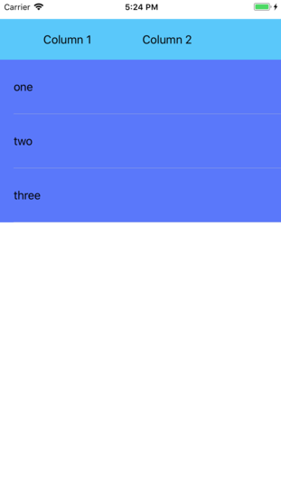

Menu: [Home](../../README.md)

## Custom UITableView Header



### Overview
Subclass UIView

### Important Functions

A simple subclass of UITableViewController added to the main view using AutoLayout.

### Important Functions

### Required TableView Delegate Functions
```swift

```


