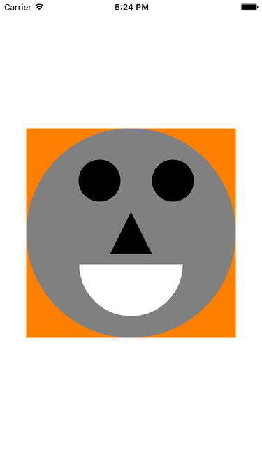

Menu: [Home](../../README.md)

## Simple Custom UIView Subclass



### Overview

Sets background color in init() and draws a rectangle

```swift

```

### Important Functions


### Additional Functions


### The Details
