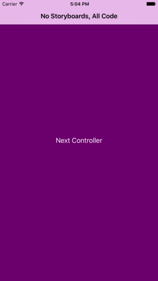

Menu: [Home](../../README.md)

## Example iOS Project without Storyboards



### Overview


### Important Functions

Example iOS Project without Storyboards.
1. Create a Single View Application
2. Remove Main.storyboard from the Target
3. Add a few lines to the AppDelegate didFinishLaunchingWithOptions:
```swift
func application(_ application: UIApplication, didFinishLaunchingWithOptions launchOptions: [UIApplicationLaunchOptionsKey: Any]?) -> Bool {
    
    self.window = UIWindow(frame: UIScreen.main.bounds)
    let navController = UINavigationController()
    self.window?.rootViewController = navController
    let topLevelController = ViewController()
    navController.addChildViewController(topLevelController)
    
    self.window?.makeKeyAndVisible()
    
    return true
}

```

4. Manage push and popping of ViewControllers.
```swift
func nextController(_ sender:UIButton) {
    let secondViewController = SecondViewController()

    self.navigationController?.pushViewController(secondViewController, animated: true)
}
```

```swift
func previousController(_ sender:UIButton) {

    _ = self.navigationController?.popViewController(animated: true)
}
```


