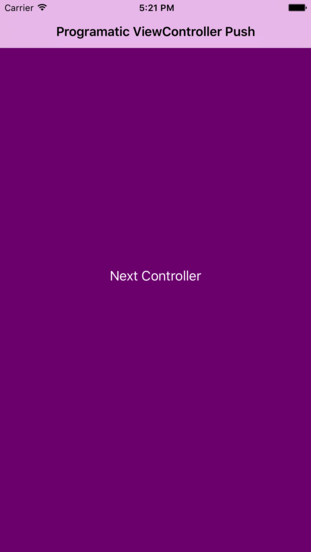

Menu: [Home](../../README.md)

## Programmatically Push View Controller



### Overview


### Important Functions


#### Important: In your Main.storyboard, you must embed the first ViewContrller in a Navigation Controller.
```
Editor -> Embed In -> Navigation Controller
```
### Manage push and popping of ViewControllers.

```swift
func nextController(_ sender:UIButton) {
    let secondViewController = SecondViewController()

    self.navigationController?.pushViewController(secondViewController, animated: true)
}
```

```swift
func previousController(_ sender:UIButton) {

    _ = self.navigationController?.popViewController(animated: true)
}
```

