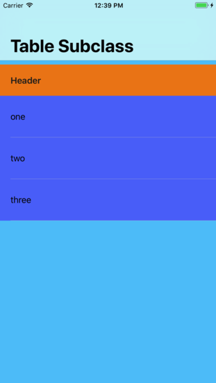

Menu: [Home](../../README.md)

## Basic UITableViewController Subclass



### Overview


### Important Functions

A simple subclass of UITableViewController added to the main view using AutoLayout.

### Important Functions

### Required TableView Delegate Functions
```swift
func tableView(tableView: UITableView, numberOfRowsInSection section: Int) -> Int
func tableView(tableView: UITableView, cellForRowAtIndexPath indexPath: NSIndexPath) -> UITableViewCell
```


### Optional TableView Delegate Functions
```swift
func numberOfSectionsInTableView(tableView: UITableView) -> Int
func tableView(tableView: UITableView, titleForHeaderInSection section: Int) -> String?
```

### Additional Functions
```swift
// Register the UITableViewCell class to be used by our UITableView
self.tableView.registerClass(UITableViewCell.self, forCellReuseIdentifier:CellIdentifier)
```


#### The Details

Since we aren't using storyboards to design our TableViewCells, we register the standard UITableViewCell in our subclasses viewDidLoad().

```swift
override func viewDidLoad() {

   self.tableView.registerClass(UITableViewCell.self, forCellReuseIdentifier:CellIdentifier)

}
```

Also, note that we use the Visual Formatting Language.  The table view is placed against the  topLayoutGuide.

```swift

```

This function tell how many sections are in the table.  In our case, it's only 1.

```swift
override func numberOfSectionsInTableView(tableView: UITableView) -> Int {

    // Return the number of sections.
    return 1

}
```

Next for a given section, we need to know how many rows are in the section.  We only have one section so we simply use the count of the array.

```swift
override func tableView(tableView: UITableView, numberOfRowsInSection section: Int) -> Int {

    return rowData.count

}
```

#### Getting a UITableViewCell

```swift
override func tableView(tableView: UITableView, cellForRowAtIndexPath indexPath: NSIndexPath) -> UITableViewCell {

    let cell = tableView.dequeueReusableCellWithIdentifier(CellIdentifier, forIndexPath: indexPath)

    // Configure the cell...

    cell.textLabel?.text = rowData[indexPath.row]

    return cell
}
```

#### Optional Header Title Function

```swift
override func tableView(tableView: UITableView, titleForHeaderInSection section: Int) -> String? {

    return "Header"

}
```
