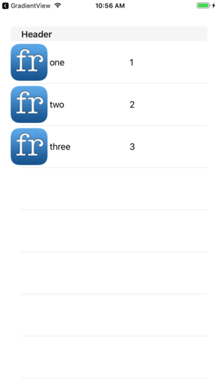

Menu: [Home](../../README.md)

## UITableView with Custom UITableViewCell



### Overview


### Important Functions

```swift
self.tableView.register(UINib(nibName: "CustomTableViewCell", bundle: nil), forCellReuseIdentifier: cellIdentifier)
```

I commonly create custom cells without Interface Builder (i.e. code only) then register the class

```swift
self.tableView.register(CustomTableViewCell.self, forCellReuseIdentifier:cellIdentifier)
```

