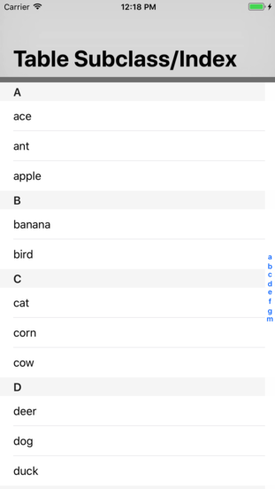

Menu: [Home](../../README.md)

## UITableViewController with Index



### Overview


### Important Functions

This example simply adds one additional function to the TableViewWithSections example:

```swift
// Simply return the entire array: ["a", "b", "c", "d", "e", "f", "g", "m"]
override func sectionIndexTitlesForTableView(tableView: UITableView) -> [String]? {

    return sectionIndex
}

```


### Important Functions

```swift
//
```


### Additional Functions
```swift
//
```


