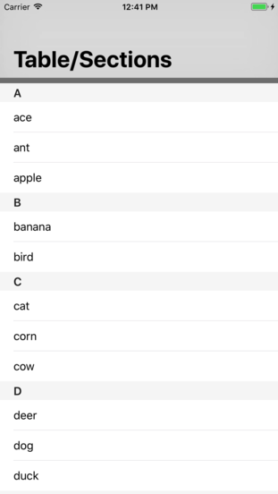

Menu: [Home](../../README.md)

## UITableViewController with Index



### Overview

This example builds upon the basic TableViewController subclass.  We build a function generateIndex() to take an array of strings and return an array containing a unique list of first letters and a dictionary that contains a list of words for each first letter.  Here's the input:


```swift
let words = ["maple", "apple", "ace", "ant",
"banana", "bird",
"cat", "corn", "cow",
"deer", "dog", "duck",
"elk", "elephant", "elm",
"fowl", "fruit",
"goat",
"milk"]
```

Here's the output:

```swift
var indexDictionary:[String:[String]] = [
"a": ["ace", "ant", "apple"],
"b": ["banana", "bird"],
"c": ["cat", "corn", "cow"],
"d": ["deer", "dog", "duck"],
"e": ["elephant", "elk", "elm"],
"f": ["fowl", "fruit"],
"g": ["goat"],
"m": ["milk", "maple"],
]

var sectionIndex:[String] = ["a", "b", "c", "d", "e", "f", "g", "m"]

```

### Important Functions

```swift
// Constructs sectionIndex:[String] and indexDictionary:[String:[String]], which are returned as a tuple
func generateIndex(wordList:[String]) -> ([String], [String:[String]])
```

### Additional Functions
```swift
//
```


### The Details
The header title method now returns an uppercase sectionIndex letter instead of the hardcoded word "Header":

```swift
    override func tableView(tableView: UITableView, titleForHeaderInSection section: Int) -> String? {

    return sectionIndex[section].uppercaseString
}
```

The number is sections is now greater than 1 and the number of rows in each section is the Array count of the indexDictionary:

```swift
    override func numberOfSectionsInTableView(tableView: UITableView) -> Int {
// Return the number of sections.
return sectionIndex.count
}

override func tableView(tableView: UITableView, numberOfRowsInSection section: Int) -> Int {

    let letter = sectionIndex[section]
    let anArray = indexDictionary[letter]
    return anArray!.count
}
```
