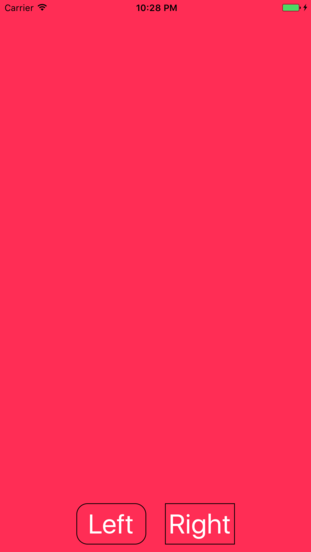

Menu: [Home](../../README.md)

## Two Buttons In StackView



### Overview

+ Buttons are equal size with 25 points between them
+ StackView is centered horizontally
+ StackView 10 points above bottom anchor
+ Add some extra padding to button width and height

```swift


```

** Important Functions

```swift


```


### Additional Functions
```swift

//
```


