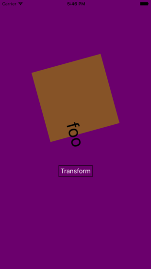

Menu: [Home](../../README.md)

## View Transforms



### Overview


### Important Functions


### Scale

```swift
func scaleIt(sender:UIButton) {
//
    UIView.animate(withDuration: 1,
        delay: 0,
        options: .curveEaseInOut,
        animations: {

            var transform = CGAffineTransform.identity
            transform = transform.scaledBy(x: 4, y: 4)
            self.label.transform = transform
            self.aView.transform = CGAffineTransform(scaleX: 6, y: 6)
        }, completion: {_ in
            self.rotateIt()
        })
    }
```

#### Rotate

```swift
func rotateIt() {
    UIView.animate(withDuration: 2,
        delay: 0,
        options: .curveEaseInOut,
        animations: {

            let transform = CGAffineTransform.identity.rotated(by: .pi)

            self.label.transform = CGAffineTransform(rotationAngle: .pi)

            self.aView.transform = transform
        }, completion: {_ in

            self.fadeIt()
        })
    }
```

#### Fade

```swift
    UIView.animate(withDuration: 2,
        delay: 0,
        options: .curveEaseInOut,
        animations: {

            self.aView.alpha = 0

        }, completion: {_ in

            UIView.animate(withDuration: 2,
                delay: 0,
                options: .curveEaseInOut,
                animations: {

                self.aView.alpha = 1
            }, completion: {_ in

            })
```

